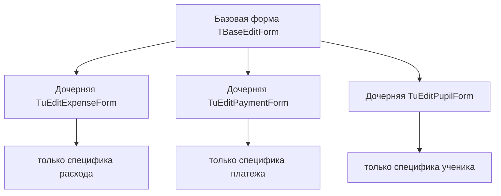
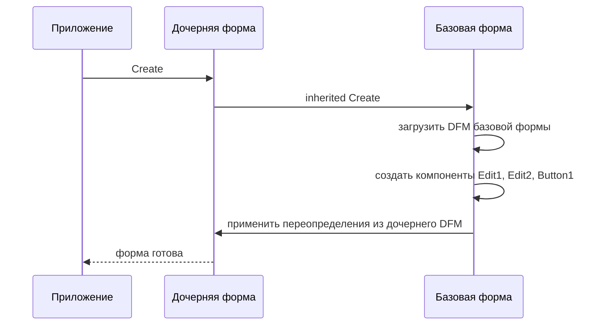
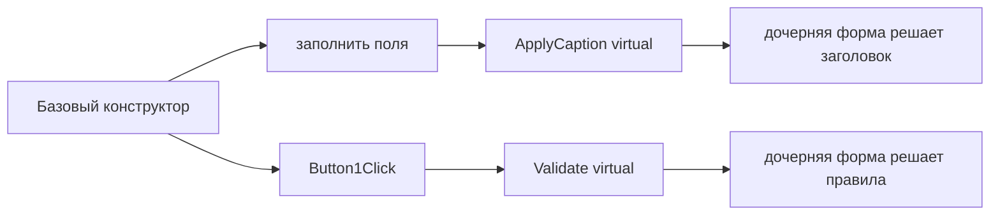
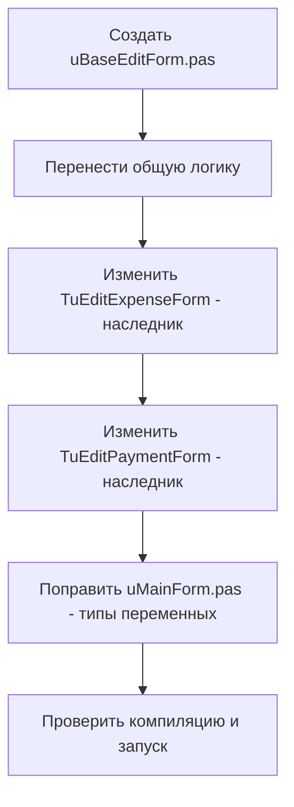

# Справка: наследование форм в Delphi (Visual Form Inheritance)

Документ описывает, как организовать наследование форм в Delphi, когда в проекте есть несколько почти одинаковых окон. На примере проекта `SchoolExpensesDemo`, где формы `TuEditExpenseForm` и `TuEditPaymentForm` дублируют друг друга.

---

## Содержание

1. [Зачем нужно наследование форм](#зачем-нужно-наследование-форм)
2. [Как работает Visual Form Inheritance](#как-работует-visual-form-inheritance)
3. [Пошаговая инструкция по созданию](#пошаговая-инструкция-по-созданию)
4. [Механика наследования в DFM](#механика-наследования-в-dfm)
5. [Виртуальные методы и точки расширения](#виртуальные-методы-и-точки-расширения)
6. [Применение к проекту SchoolExpensesDemo](#применение-к-проекту-schoolexpensesdemo)
7. [Альтернативные подходы](#альтернативные-подходы)
8. [Типичные ошибки и подводные камни](#типичные-ошибки-и-подводные-камни)
9. [Чек-лист рефакторинга](#чек-лист-рефакторинга)

---

## Зачем нужно наследование форм

Когда в проекте появляется несколько окон с одинаковой структурой (те же поля ввода, те же кнопки, та же логика валидации), возникает соблазн скопировать форму и немного изменить. Это приводит к:

- **дублированию кода** — правку в одной форме нужно повторять во всех копиях;
- **расхождению** — со временем копии «разъезжаются», баг-фикс в одной не попадает в другую;
- **ошибкам типов** — в похожих формах легко перепутать класс (см. ниже про `uMainForm.pas`).

Наследование форм решает эти проблемы: общая часть живёт в **базовой форме**, а каждая дочерняя содержит только отличия.



---

## Как работает Visual Form Inheritance

Delphi поддерживает **Visual Form Inheritance (VFI)** — механизм, при котором дочерняя форма наследует не только Pascal-класс, но и **визуальную структуру** из DFM-файла базовой формы.

Это значит, что дочерняя форма автоматически получает:

- все компоненты базовой формы (кнопки, поля, надписи);
- их свойства (положение, размер, текст);
- обработчики событий.

Дочерняя форма может:

- **переопределять** свойства унаследованных компонентов (другой `Caption`, `TextHint`);
- **добавлять** новые компоненты, которых нет в базовой форме;
- **переопределять** методы базового класса (если они объявлены `virtual`).



---

## Пошаговая инструкция по созданию

### Шаг 1. Создать базовую форму

1. В IDE: `File → New → Form`.
2. Сохранить модуль как `uBaseEditForm.pas`, класс назвать `TBaseEditForm`.
3. Разместить на форме общие компоненты: `Edit1`, `Edit2`, `Edit3`, `Button1`, `Button2`.
4. Перенести в базовый класс общую логику — конструктор и обработчик `Button1Click`.

```pascal
unit uBaseEditForm;

interface

uses
  Winapi.Windows, Winapi.Messages, System.SysUtils, System.Variants,
  System.Classes, Vcl.Graphics, Vcl.Controls, Vcl.Forms, Vcl.Dialogs,
  Vcl.StdCtrls;

type
  TBaseEditForm = class(TForm)
    Edit1: TEdit;   // Дата
    Edit2: TEdit;   // Назначение
    Edit3: TEdit;   // Сумма
    Button1: TButton; // ОК
    Button2: TButton; // Отмена
    procedure Button1Click(Sender: TObject);
  protected
    procedure ApplyCaption; virtual;        // точка расширения
    function Validate: Boolean; virtual;     // точка расширения
  public
    constructor Create(AOwner: TComponent; const ADate, APurpose,
      ASum: string); virtual;
  end;

implementation

{$R *.dfm}

constructor TBaseEditForm.Create(AOwner: TComponent;
  const ADate, APurpose, ASum: string);
begin
  inherited Create(AOwner);
  Edit1.Text := ADate;
  Edit2.Text := APurpose;
  Edit3.Text := ASum;
  ApplyCaption;
end;

procedure TBaseEditForm.ApplyCaption;
begin
  // по умолчанию — ничего, дочерняя форма переопределит
end;

function TBaseEditForm.Validate: Boolean;
begin
  Result := Trim(Edit1.Text) <> '';
  if not Result then
    ShowMessage('Дата обязательна');
end;

procedure TBaseEditForm.Button1Click(Sender: TObject);
begin
  if Validate then
    ModalResult := mrOk;
end;

end.
```

### Шаг 2. Создать дочернюю форму через наследование

1. В IDE: `File → New → Other`.
2. В диалоге выбрать `Inheritable Items` (в новых версиях Delphi — `Inheritable Form`).
3. Выбрать базовую форму `TBaseEditForm`.
4. Сохранить как `uUpdateExenseForm.pas`, класс `TuEditExpenseForm`.

IDE автоматически сгенерирует:

- Pascal-файл с классом `TuEditExpenseForm = class(TBaseEditForm)`;
- DFM-файл, начинающийся со слова `inherited`.

### Шаг 3. Настроить отличия в дочерней форме

В дочернем классе переопределить только то, что отличается:

```pascal
unit uUpdateExenseForm;

interface

uses
  uBaseEditForm;

type
  TuEditExpenseForm = class(TBaseEditForm)
  protected
    procedure ApplyCaption; override;
  end;

implementation

{$R *.dfm}

procedure TuEditExpenseForm.ApplyCaption;
begin
  Caption := 'Редактирование расхода';
end;

end.
```

### Шаг 4. Подключить модули в проекте

В файле `.dpr` убедиться, что базовая форма подключена **до** дочерних:

```pascal
uses
  // ...
  uBaseEditForm in 'uBaseEditForm.pas' {BaseEditForm},
  uUpdateExenseForm in 'uUpdateExenseForm.pas' {uEditExpenseForm},
  uUpdatePaymentForm in 'uUpdatePaymentForm.pas' {uEditPaymentForm};
```

---

## Механика наследования в DFM

При наследовании первая строка дочернего DFM меняется с `object` на `inherited`:

```dfm
inherited uEditExpenseForm: TuEditExpenseForm
  Caption = #1056#1077#1076#1072#1082#1090#1080#1088#1086#1074#1072#1085#1080#1077
  // Edit1, Edit2, Edit3, Button1, Button2 НЕ описываются —
  // они приходят из базового DFM автоматически
end
```

### Правила DFM при наследовании

| Ключевое слово в DFM | Что означает |
|---|---|
| `inherited` (в начале) | форма наследует всю структуру базовой формы |
| `inherited Edit1: TEdit` | переопределить свойства унаследованного компонента |
| `object NewLabel: TLabel` | добавить **новый** компонент, которого нет в базовой форме |
| компонент не упомянут | берётся из базовой формы как есть |

Пример переопределения свойства унаследованного компонента:

```dfm
inherited uEditExpenseForm: TuEditExpenseForm
  Caption = 'Расход'
  inherited Edit1: TEdit
    TextHint = 'Дата расхода'   // переопределён TextHint
  end
end
```

### Важные ограничения

- **Удалить** унаследованный компонент напрямую нельзя — это ограничение VFI. Компонент можно только скрыть (`Visible = False`) или переместить за пределы видимой области.
- Если в базовой форме переименовать или удалить компонент, дочерние формы, которые его переопределяли, перестанут компилироваться — нужно править их DFM вручную.
- DFM-файлы дочерних форм хранят **только отличия** от базовой, поэтому они обычно очень короткие.

---

## Виртуальные методы и точки расширения

Чтобы дочерние формы могли влиять на поведение базовой, в базовом классе объявляют **виртуальные методы** — «точки расширения». Базовый класс вызывает их в нужные моменты, а дочерний переопределяет.



Шаблон «метод-шаблон» (Template Method):

```pascal
// базовая форма
protected
  procedure ApplyCaption; virtual;
  function Validate: Boolean; virtual;
  procedure BeforeShow; virtual;
```

Дочерняя форма переопределяет только нужные:

```pascal
procedure TuEditPaymentForm.ApplyCaption;
begin
  Caption := 'Редактирование платежа';
end;

function TuEditPaymentForm.Validate: Boolean;
begin
  Result := inherited Validate;          // вызвать базовую проверку
  if Result and (Trim(Edit3.Text) = '') then
  begin
    ShowMessage('Сумма обязательна');
    Result := False;
  end;
end;
```

Ключевое слово `inherited` в переопределённом методе вызывает реализацию базового класса — это позволяет **дополнять**, а не заменять логику.

---

## Применение к проекту SchoolExpensesDemo

В текущем проекте формы `TuEditExpenseForm` и `TuEditPaymentForm` практически идентичны:

- одинаковые поля `Edit1`, `Edit2`, `Edit3`, `Button1`, `Button2`;
- одинаковый конструктор с параметрами `ADate, APurpose, ASum`;
- одинаковая логика в `Button1Click`;
- DFM-файлы совпадают байт-в-байт.

Это идеальный кандидат на VFI.

### План рефакторинга



1. Создать `uBaseEditForm.pas` с классом `TBaseEditForm`, перенести туда общие компоненты и логику.
2. В `uUpdateExenseForm.pas` заменить `class(TForm)` на `class(TBaseEditForm)`, удалить дублирующийся код.
3. В `uUpdatePaymentForm.pas` сделать то же самое.
4. В `uMainForm.pas` исправить типы переменных `EditForm` — использовать `TBaseEditForm` или конкретный класс.

### Найденная ошибка в uMainForm.pas

В методе `ExpenseGridDbClick` переменная объявлена как `TuEditPaymentForm`, хотя обрабатывается расход:

```pascal
procedure TMainForm.ExpenseGridDbClick(Sender: TObject);
var
  ExpenseId: Integer;
  EditForm: TuEditPaymentForm;   // <-- должно быть TuEditExpenseForm
begin
  // ...
  EditForm := TuEditPaymentForm.Create(Self, ...);  // <-- создаётся форма платежа для расхода
```

После перехода на общий базовый класс `TBaseEditForm` обе переменные можно объявить как `TBaseEditForm`, и такие ошибки исчезнут:

```pascal
var
  EditForm: TBaseEditForm;
begin
  EditForm := TuEditExpenseForm.Create(Self, ...);
```

---

## Альтернативные подходы

VFI — не единственный способ убрать дублирование. Выбор зависит от того, **что именно** общего у форм.

| Подход | Когда применять | Плюсы | Минусы |
|---|---|---|---|
| **Visual Form Inheritance** | Формы разделяют и UI, и логику | наследуется и код, и визуальная структура | жёсткая связь через DFM, сложно удалять компоненты |
| **Фреймы (TFrame)** | Переиспользуемая группа компонентов, вставляемая в разные формы | гибкость, можно комбинировать несколько фреймов | не наследует логику формы целиком |
| **Общий предок без DFM** | Общая логика, но разный UI | простота, нет связи через DFM | визуальную структуру всё равно дублировать |
| **Композиция / helper-классы** | Логика общая, формы совсем разные | максимальная гибкость | больше ручной работы |

Для проекта `SchoolExpensesDemo`, где DFM-файлы форм совпадают полностью, **VFI — оптимальный выбор**: одна базовая форма, две пустых дочерних, дублирование исчезает.

---

## Типичные ошибки и подводные камни

### 1. Перепутанный тип переменной

```pascal
// ОШИБКА: форма платежа используется для расхода
EditForm: TuEditPaymentForm;
EditForm := TuEditPaymentForm.Create(Self, ...);
```

Решение: использовать базовый тип `TBaseEditForm` для переменной, конкретный класс — при создании.

### 2. Забытый `inherited` в конструкторе

```pascal
constructor TuEditExpenseForm.Create(...);
begin
  // inherited Create(AOwner);  <-- забыли!
  Edit1.Text := ADate;  // Access violation: форма ещё не создана
end;
```

Всегда вызывайте `inherited Create(AOwner)` первой строкой конструктора.

### 3. Удаление компонента в дочерней форме

VFI не позволяет удалить унаследованный компонент. Попытка стереть его из DFM приведёт к ошибке загрузки. Вместо этого:

```dfm
inherited Edit3: TEdit
  Visible = False
end
```

### 4. Переименование компонента в базовой форме

Если в `TBaseEditForm` переименовать `Edit1` в `edDate`, все дочерние DFM, которые переопределяли `Edit1`, перестанут компилироваться. Нужно вручную править каждый дочерний DFM.

### 5. Циклическое наследование

Нельзя создать цепочку `A → B → A`. IDE не даст это сделать, но при ручном редактировании DFM можно получить неработающую форму.

### 6. Базовая форма не подключена в .dpr

Если `uBaseEditForm` не указан в `uses` файла `.dpr` (или указан после дочерних), компилятор не найдёт базовый класс. Базовый модуль должен идти **раньше** дочерних.

---

## Чек-лист рефакторинга

- [ ] Создан модуль `uBaseEditForm.pas` с классом `TBaseEditForm`
- [ ] Общие компоненты перенесены в базовую форму
- [ ] Общий конструктор и `Button1Click` перенесены в базовый класс
- [ ] Точки расширения объявлены как `virtual` (`ApplyCaption`, `Validate`)
- [ ] `uBaseEditForm` подключён в `.dpr` перед дочерними формами
- [ ] `TuEditExpenseForm` изменён на `class(TBaseEditForm)`
- [ ] `TuEditPaymentForm` изменён на `class(TBaseEditForm)`
- [ ] Дублирующийся код удалён из дочерних форм
- [ ] DFM дочерних форм начинаются с `inherited`
- [ ] В `uMainForm.pas` исправлены типы переменных `EditForm`
- [ ] Проект компилируется без ошибок
- [ ] Формы открываются и работают как раньше
- [ ] Проверены оба сценария: платёж и расход

---

## Краткая шпаргалка

```pascal
// Базовая форма
TBaseEditForm = class(TForm)
  // общие компоненты и логика
protected
  procedure ApplyCaption; virtual;   // точка расширения
public
  constructor Create(...); virtual;
end;

// Дочерняя форма
TuEditExpenseForm = class(TBaseEditForm)
protected
  procedure ApplyCaption; override;  // только отличия
end;
```

```dfm
// Базовый DFM
object BaseEditForm: TBaseEditForm
  // все компоненты
end

// Дочерний DFM
inherited uEditExpenseForm: TuEditExpenseForm
  Caption = 'Расход'   // только переопределённое
end
```

Главный принцип: **в базовой форме — всё общее, в дочерних — только отличия**.
